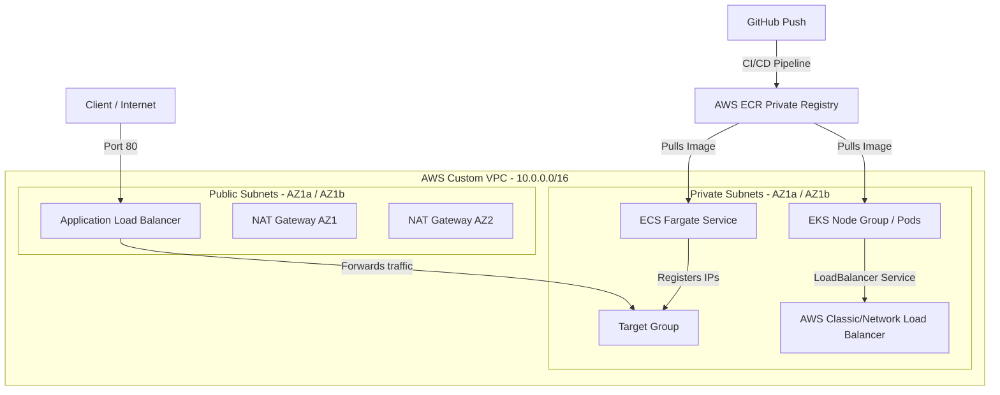

# DevOps Pipeline: Multi-Orchestration AWS Cluster (ECS Fargate & EKS Kubernetes) + Terraform + GitHub Actions

This is a comprehensive, production-grade DevOps project that implements a highly available, multi-orchestrator infrastructure-as-code (IaC) architecture using **Terraform**. It runs an optimized containerized web application deployed simultaneously or selectively to **AWS ECS Fargate** and **AWS EKS (Elastic Kubernetes Service)**. The code deployment pipeline is fully automated using **Release-Based CI/CD** via **GitHub Actions** and stores states securely using an **AWS S3 Remote Backend with DynamoDB Locks**.

---

## 🏗️ Infrastructure Architecture

The infrastructure is fully modularized in Terraform and consists of the following key components:



1. **Networking (VPC)**:
   * 1 Custom VPC (`10.0.0.0/16`) with public DNS hostnames resolution enabled.
   * 2 Public Subnets (to host the Application Load Balancer and the NAT Gateways) tagged with `"kubernetes.io/role/elb" = "1"` to allow EKS public LoadBalancers.
   * 2 Private Subnets (to safely isolate ECS Fargate tasks and EKS Worker Nodes) tagged with `"kubernetes.io/role/internal-elb" = "1"` for internal/private LoadBalancers.
   * 1 Internet Gateway to provide internet routing for the public subnets.
   * 2 NAT Gateways with associated Elastic IPs, providing highly available outbound internet routing for the private subnets.

2. **Security (IAM & Security Groups)**:
   * **ALB Security Group**: Allows inbound HTTP traffic (port 80) from any origin.
   * **ECS Tasks Security Group**: Restricts inbound traffic strictly to connections originating from the ALB Security Group.
   * **IAM Roles**: Standard Roles for ECS execution (`ecs_task_execution_role`), ECS application task level (`ecs_task_role`), EKS Cluster control plane (`eks_cluster_role`), and EKS Worker Node Groups (`eks_node_role`).

3. **Load Balancing (ALB & ELB)**:
   * Highly available, public-facing Application Load Balancer for the ECS stack.
   * Kubernetes `LoadBalancer` Service which automatically provisions an AWS Load Balancer (ELB) to route external traffic to Kubernetes Pods.

4. **Compute (ECS Fargate & EKS Kubernetes)**:
   * **AWS ECR (Elastic Container Registry)**: Private repository to store built Docker images.
   * **AWS ECS Fargate**: Serverless container orchestration for microservices.
   * **AWS EKS (Elastic Kubernetes Service)**: Managed Kubernetes control plane paired with an EC2 Managed Node Group (`t3.medium` instances) scaled dynamically (Min: 1, Max: 3, Desired: 2).

---

## 📂 Repository Structure

The project maintains a strict separation of concerns:

```text
aws-ecs-fargate-cicd/
├── .github/
│   └── workflows/
│       └── deploy.yaml         # Automated Release-Based CI/CD pipeline (GitHub Actions)
├── app/                        # Application Layer (Node.js Express)
│   ├── public/
│   │   ├── index.html          # Interactive dark-mode DevOps Dashboard
│   │   ├── scripts.js          # Client-side JavaScript logic
│   │   └── styles.css          # Cyberpunk/glassmorphism CSS styles
│   ├── index.js                # Lightweight Node.js server
│   ├── package.json            # Node.js dependencies
│   └── Dockerfile              # Optimized Alpine-based Docker recipe
├── k8s/                        # Kubernetes Resource Manifests
│   ├── deployment.yaml         # App Deployment spec (with resource requests & health probes)
│   ├── service.yaml            # LoadBalancer service spec
│   └── hpa.yaml                # Horizontal Pod Autoscaler (elastically scales 1 to 2 pods)
├── terraform/                  # Infrastructure Layer (IaC)
│   ├── environment/
│   │   └── dev/                # Development Environment (Root deployment)
│   │       ├── main.tf
│   │       ├── outputs.tf
│   │       ├── providers.tf    # Remote Backend configuration
│   │       └── variables.tf
│   └── modules/                # Reusable modules
│       ├── alb/                # Application Load Balancer resources
│       ├── ecs/                # ECS Cluster, ECR, Task Def, and Fargate Service
│       ├── eks/                # EKS Cluster, IAM roles, and Managed Node Groups
│       ├── networking/         # Networking and VPC routing resources (w/ K8s tags)
│       └── security/           # IAM Roles and Security Groups for ECS/ALB
├── .gitignore                  # Prevents committing local state & credentials
└── README.md                   # Technical documentation
```

---

## 🛠️ Prerequisites

Before deploying, make sure you have:
1. An active **Amazon Web Services (AWS)** account.
2. **AWS CLI** installed and configured locally (`aws configure`).
3. **Terraform** v1.5+ installed.
4. **Kubectl** installed (to interact with EKS).
5. **Git** configured on your local workstation.

---

## 📦 S3 Remote State Backend (with DynamoDB Lock)

To run this infrastructure securely in a production or team environment (and safely run GitHub Actions workflows), the state is stored remotely rather than on your local computer.

### Bootstrapping S3 and DynamoDB:
Create these resources in AWS using the AWS CLI:
```bash
# 1. Create S3 Bucket for Terraform State
aws s3api create-bucket --bucket my-project-tf-state-us-east-1 --region us-east-1

# 2. Create DynamoDB Table for State Locking
aws dynamodb create-table \
    --table-name terraform-ha-dev-locks \
    --attribute-definitions AttributeName=LockID,AttributeType=S \
    --key-schema AttributeName=LockID,KeyType=HASH \
    --billing-mode PAY_PER_REQUEST \
    --region us-east-1
```

Once created, the configuration in `terraform/environment/dev/providers.tf` will store and lock your state files dynamically on every operation.

---

## 🚀 Infrastructure Deployment with Terraform

To provision the infrastructure in AWS using Terraform, run the following commands from the `terraform/environment/dev` directory:

```bash
# Initialize AWS providers, modules, and the S3 Remote Backend
terraform init

# Plan the infrastructure changes (checks networks, ECS, EKS, ALB)
terraform plan

# Apply the configuration to deploy the infrastructure to AWS
terraform apply --auto-approve
```

Once the deployment completes, Terraform will output your resources info:
* `ecr_repository_url`: The URL of your private Docker registry in AWS.
* `alb_dns_name`: The public DNS URL of your ECS Application Load Balancer.
* `eks_cluster_name`: The name of the EKS cluster (`dev-eks`).
* `eks_cluster_endpoint`: The API endpoint URL for your Kubernetes cluster.

---

## ☸️ Deploying the Application to Kubernetes (EKS)

After Terraform successfully deploys the EKS cluster, connect to your Kubernetes cluster and apply the manifests:

```bash
# 1. Configure kubectl to connect to the AWS EKS Cluster
aws eks update-kubeconfig --region us-east-1 --name dev-eks

# 2. Verify connection to EKS cluster nodes
kubectl get nodes

# 3. Apply the Kubernetes manifests (creates deployment, service, and HPA)
kubectl apply -f k8s/

# 4. View the public URL of the LoadBalancer Service
kubectl get service devops-dashboard-service
```

---

## 🔄 Release-Based Continuous Integration & Deployment (CI/CD)

The automation pipeline is built with **GitHub Actions** (`.github/workflows/deploy.yaml`) and triggers automatically on every `push` to `master` branch (for CI checks) or when tagging a version release `v*.*.*` (for CD production deployments).

### 🔑 GitHub Repository Secrets Configuration:
Configure the following secrets in your repository settings (**Settings -> Secrets and variables -> Actions -> Secrets**):
* `AWS_ACCESS_KEY_ID`: Your AWS Access Key ID.
* `AWS_SECRET_ACCESS_KEY`: Your AWS Secret Access Key.

### 🕹️ How to Trigger a Production Release
When you decide your application is ready to be published to production:

1. Create and push a version tag locally:
   ```bash
   git tag v1.0.0
   git push origin v1.0.0
   ```
2. Or go to your **GitHub Repository** -> **Releases** -> **Create a new Release** and create the `v1.0.0` tag.
3. The pipeline will automatically execute the deployment to update your containers.

---

## 🧹 Infrastructure Clean Up

To avoid incurring unwanted charges in AWS (especially for running EKS EC2 instances and NAT Gateways), destroy all the provisioned infrastructure when finished:

```bash
# 1. Delete Kubernetes resources
kubectl delete -f k8s/

# 2. Destroy AWS infrastructure with Terraform
cd terraform/environment/dev
terraform destroy --auto-approve
```

---

## 👤 Author

* **Roberto Palacios** - [LinkedIn Profile](https://www.linkedin.com/in/robpalacios1/)