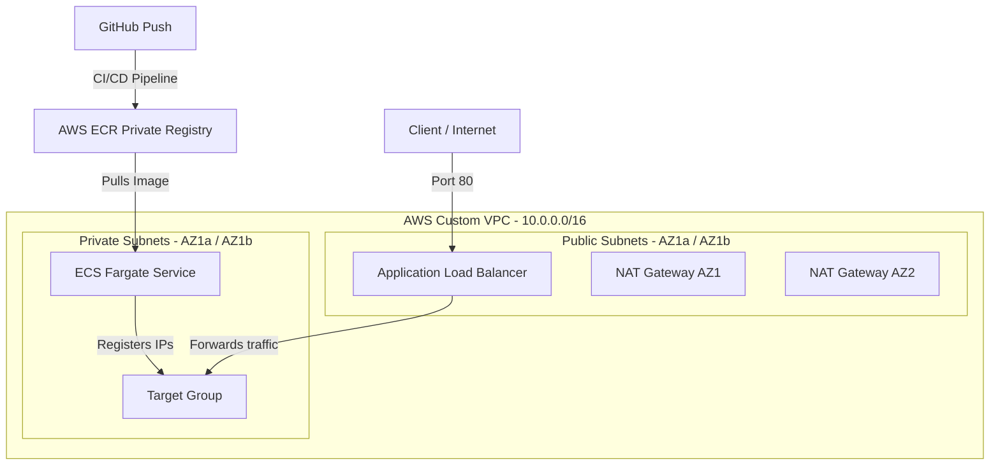
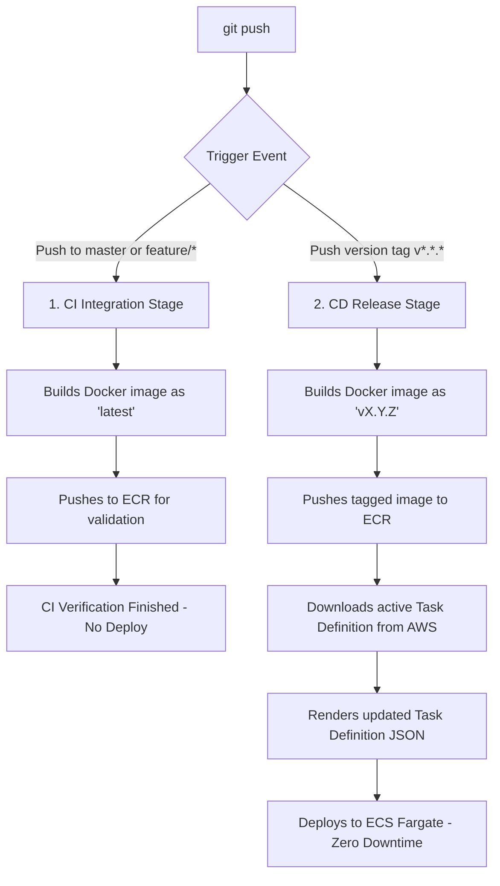

# DevOps Pipeline: AWS ECS Fargate + Terraform + Release-Based GitHub Actions CI/CD

This is a professional-grade DevOps project that implements a highly available infrastructure-as-code (IaC) architecture using **Terraform**, packages an interactive web application into an optimized container using **Docker**, and automates the entire software release cycle using a **Release-Based CI/CD** workflow via **GitHub Actions** to **AWS ECS Fargate** and **AWS ALB**.

---

## 🏗️ Infrastructure Architecture

The infrastructure is fully modularized in Terraform and consists of the following key components:



1. **Networking (VPC)**:
   * 1 Custom VPC (`10.0.0.0/16`) with public DNS hostnames resolution enabled.
   * 2 Public Subnets (to host the Application Load Balancer and the NAT Gateways).
   * 2 Private Subnets (to safely isolate the ECS Fargate tasks/containers from public access).
   * 1 Internet Gateway to provide internet routing for the public subnets.
   * 2 NAT Gateways with associated Elastic IPs, providing highly available outbound internet routing for the private containers without exposing them publicly.

2. **Security (IAM & Security Groups)**:
   * **ALB Security Group**: Allows inbound HTTP traffic (port 80) from any origin.
   * **ECS Tasks Security Group**: Restricts inbound traffic **strictly** to connections originating from the ALB Security Group, shielding the containers from direct public exposure.
   * **IAM Roles**: `ecs_task_execution_role` (pre-configured with the standard AWS policy to pull images from ECR and write logs to CloudWatch) and `ecs_task_role` (for container-level permissions).

3. **Load Balancing (ALB)**:
   * Highly available, public-facing Application Load Balancer.
   * Target Group with active Health Checks (monitoring system health on the `/` path).
   * HTTP Listener that listens on port 80 and forwards incoming requests to the Target Group.

4. **Compute (ECS & ECR)**:
   * AWS ECR (Elastic Container Registry) private repository to store the Docker images compiled by the CI/CD pipeline.
   * AWS ECS Cluster and Service configured under the Serverless **Fargate** launch type.
   * Task Definition specifying lightweight compute resources (256 CPU, 512 MB Memory) with stdout/stderr logs shipped to **Amazon CloudWatch**.

---

## 📂 Repository Structure

The project maintains a strict separation of concerns:

```text
aws-ecs-fargate-cicd/
├── .github/
│   └── workflows/
│       └── deploy.yaml         # Automated Release-Based CI/CD pipeline (GitHub Actions)
├── app/                        # Application Layer
│   ├── public/
│   │   └── index.html          # Interactive dark-mode DevOps Dashboard
│   ├── index.js                # Lightweight Node.js Express server
│   ├── package.json            # Node.js dependencies
│   └── Dockerfile              # Optimized Alpine-based Docker recipe
├── terraform/                  # Infrastructure Layer (IaC)
│   ├── environment/
│   │   └── dev/                # Development Environment (Root deployment)
│   │       ├── main.tf
│   │       ├── outputs.tf
│   │       ├── providers.tf
│   │       └── variables.tf
│   └── modules/                # Reusable modules
│       ├── alb/                # Application Load Balancer resources
│       ├── ecs/                # ECS Cluster, ECR, Task Def, and Fargate Service
│       ├── networking/         # Networking and VPC routing resources
│       └── security/           # IAM Roles and Security Groups
├── .gitignore                  # Prevents committing local state & credentials
└── README.md                   # Technical documentation
```

---

## 🛠️ Prerequisites

Before deploying, make sure you have:
1. An active **Amazon Web Services (AWS)** account.
2. **AWS CLI** installed and configured locally (`aws configure`) with Administrator/PowerUser credentials.
3. **Terraform** v1.5+ installed.
4. **Git** configured on your local workstation.

---

## 🚀 Infrastructure Deployment with Terraform

To provision the infrastructure in AWS using Terraform, run the following commands from the root of your repository:

```bash
# 1. Navigate to the development environment directory
cd terraform/environment/dev

# 2. Initialize AWS providers and modules
terraform init

# 3. Plan the infrastructure changes (approx. 20 resources to be created)
terraform plan

# 4. Apply the configuration to deploy the infrastructure to AWS
terraform apply --auto-approve
```

Once the deployment completes, Terraform will output two useful values:
* `ecr_repository_url`: The URL of your private Docker registry in AWS.
* `alb_dns_name`: The public DNS URL of your Application Load Balancer.

---

## 📦 Containerizing the Application

The web application is a lightweight **Node.js** server serving a stunning dark-mode DevOps Dashboard designed to display container status, uptime, and metadata.

The Docker image is built using an ultra-lightweight base image (`node:18-alpine`), significantly reducing the final image size to accelerate push/pull times during the CI/CD execution:

```dockerfile
FROM node:18-alpine
WORKDIR /usr/src/app
COPY package*.json ./
RUN npm ci --only=production
COPY . .
EXPOSE 80
CMD [ "npm", "start" ]
```

---

## 🔄 Release-Based Continuous Integration & Deployment (CI/CD)

The automation pipeline is built with **GitHub Actions** (`.github/workflows/deploy.yaml`) and implements a dual-stage workflow model reflecting enterprise release-management best practices.

### 🔑 GitHub Repository Secrets Configuration:
To authorize the GitHub runner to deploy to your AWS account, configure the following secrets in your repository settings (**Settings -> Secrets and variables -> Actions -> Secrets**):
* `AWS_ACCESS_KEY_ID`: Your AWS Access Key ID.
* `AWS_SECRET_ACCESS_KEY`: Your AWS Secret Access Key.

---

### 🚀 Double-Stage Pipeline Workflow Model



#### 1. Continuous Integration Stage (CI)
* **Trigger**: Automated on every push to branches `master` or development branches `feature/*`.
* **Action**: Clones the repository, authenticates to AWS ECR, and builds the Docker image tagging it as `latest`.
* **Goal**: Verifies that the codebase is healthy and builds without errors. **Does not alter the live running servers on AWS**, preventing intermediate development bugs from reaching production.

#### 2. Continuous Deployment Stage (CD)
* **Trigger**: Activated **exclusively** when a version tag (`v*.*.*`) is pushed (e.g. `v1.0.0`, `v1.2.0`), or when you create a new **GitHub Release** inside the UI.
* **Action**:
  * Builds the Docker image and tags it with the exact release version name (e.g. `v1.0.0`).
  * Pushes the versioned image to **AWS ECR**.
  * Dynamically downloads the active **Task Definition** from AWS ECS.
  * Renders the updated Task Definition JSON with the new versioned image URI.
  * Deploys the new Task Definition to **AWS ECS Fargate** using a zero-downtime rolling update deployment.

---

### 🕹️ How to Trigger a Production Release
When you decide your application is ready to be published to production:

1. Create and push a version tag locally:
   ```bash
   git tag v1.0.0
   git push origin v1.0.0
   ```
2. Or go to your **GitHub Repository** -> **Releases** -> **Create a new Release** and create the `v1.0.0` tag directly through the user interface.
3. The pipeline will automatically execute the **CD Release Stage** and safely update your Fargate service.

---

## 🧹 Infrastructure Clean Up

To avoid incurring unwanted charges in AWS, you can destroy all the provisioned infrastructure and services with a single command from the `terraform/environment/dev` directory:

```bash
terraform destroy --auto-approve
```